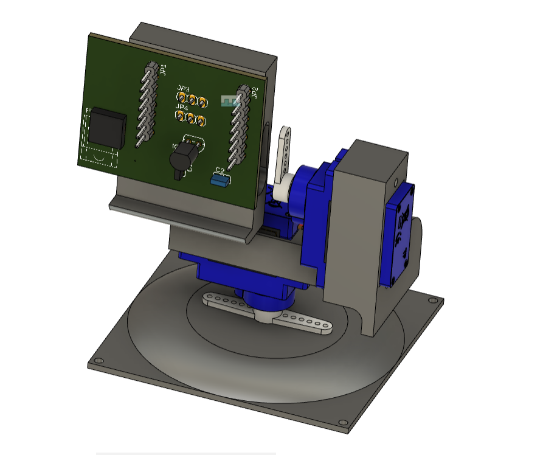
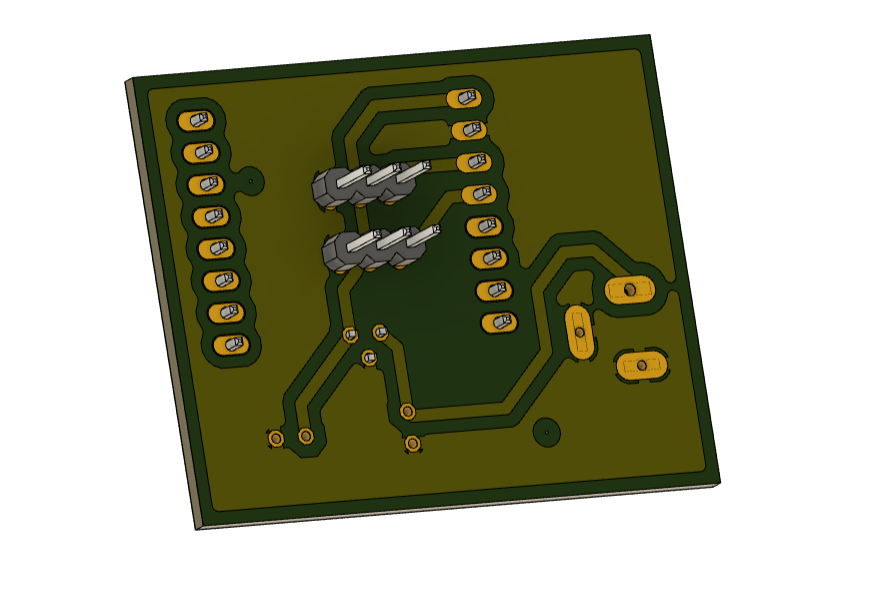
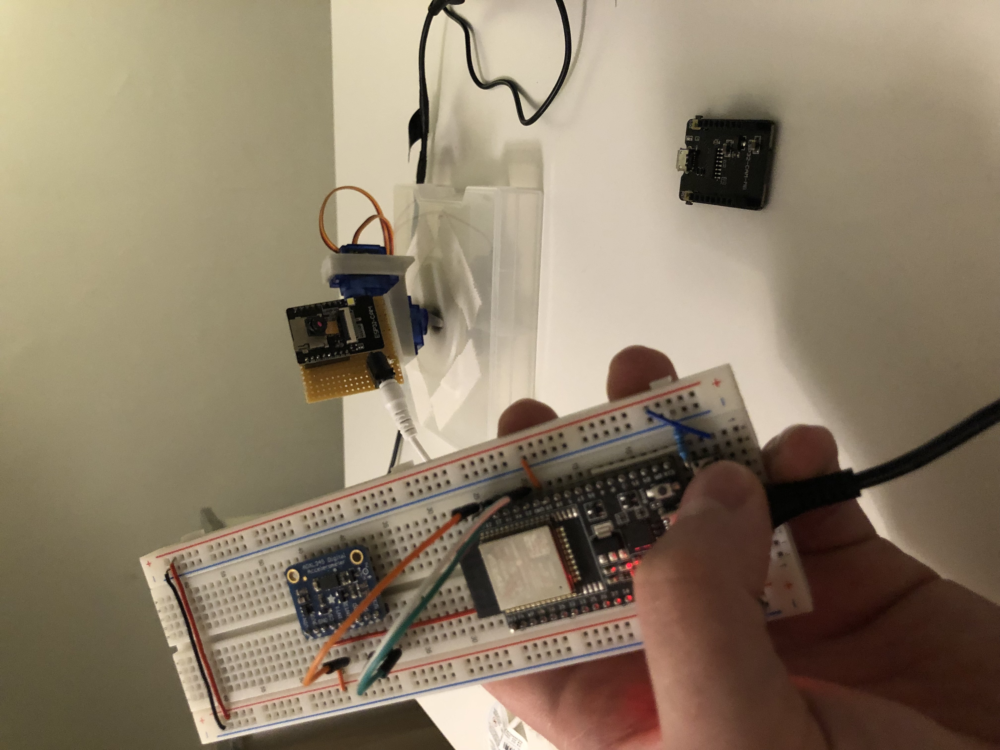

# ESP-NOW Wireless Camera Control with Accelerometer 

Welcome to the ESP-NOW Wireless Camera Control project! This repository showcases a versatile solution for wirelessly controlling an ESP32-CAM using the ESP-Now protocol. The system is enhanced with an accelerometer, allowing intuitive gesture-based commands.

## Features
- Wireless communication using ESP-NOW protocol.
- Integration of an accelerometer for gesture-based control.
- ESP32 WROOM acting as a transmitter, hosted on a breadboard.
- ESP32-CAM enclosed in a 3D-printed frame, providing stability and protection.
- Dual-axis rotation for enhanced camera positioning.

## Project Structure

- **3D_Model:** Stores the 3D printed part models.
- **Images:** Stores project-related images.
- **PCB_Design:** Contains PCB design-related files. (Unavailable, since the PCB design is so simple it can be done on a perf board)
- **Source_Code:** Houses the source code for both the transmitter and receiver.
- **README.md:** The main documentation file providing an overview of the project, and features.

Design process: 

  
  

Results: 

Roll and pitch of the remote control(esp32 on a breadboard) effectively change the yaw and pitch of the esp32-cam by rotating the two servos respectively. And the push-button turns the on-board LED on.

Videos of the working prototype can be found on my Instagram. 
